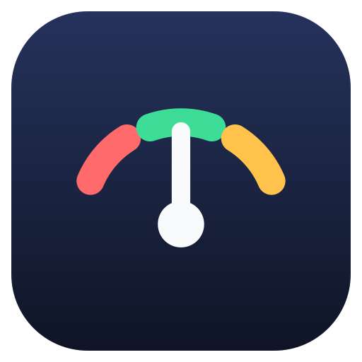

<p align="center">
  
</p>

<h1 align="center">TUNAR · 吐呐</h1>

<p align="center">
  Breathe with sound. Tune with confidence. · Shared Rust core × native apps
</p>

<p align="center">
  
  
  
</p>

<p align="center">
  <strong>English</strong> · <a href="README.zh-CN.md">简体中文</a>
</p>

---

## Features

**Universal tuner**

- Pitch accuracy within ±0.5 cent using YIN plus harmonic-model refinement.
- Adjustable noise gate, two-frame confirmation, hysteresis, and persistent last reading.
- Aurora dial with a single responsive needle and no historical ghost needles.
- Fixed Do, movable Do, numbered notation, and Chinese gongche-style scale naming.
- Integrated professional analysis with musical/full-range FFT, 12-second pitch trace,
  live waveform envelope, measured peak labels, waterfall history, and chord detection.
- Reference-tone generator for 12, 19, 24, and 31 equal divisions of the octave.
- Pro temperament mode with configurable A4 calibration.

**Instrument tuning**

- Guitar, ukulele, and guqin tunings.
- Zhudi, dongxiao, and shakuhachi fingering charts.
- Automatic target matching or manually locked strings/notes.

**Metronome**

- 30–250 BPM, tap tempo, time signatures, and per-beat accents.
- Twelve common synthesized click sounds with separate strong/weak beat choices.
- Sample-accurate scheduling and native background playback.

## Architecture

```text
android/  Kotlin + Jetpack Compose
ios/      SwiftUI
macos/    SwiftUI for macOS 14+
    │     UniFFI-generated native bindings
core/     Rust: pitch, notation, presets, metronome, spectrum, chords, temperaments
```

All business and DSP rules live in the Rust core. Native layers handle only UI, audio
devices, permissions, playback, and lifecycle. The public cross-language contract is
documented in [docs/en/spec-core.md](docs/en/spec-core.md).

## Build

```bash
# Shared core
cd core && cargo test

# Android bindings, app, and tests
scripts/build-core-android.sh
cd android && ./gradlew assembleDebug testDebugUnitTest

# Apple bindings and universal iOS/macOS XCFramework
scripts/build-core-ios.sh

# iOS generated project and simulator tests
cd ios && xcodegen generate
xcodebuild -scheme Tuner -destination 'platform=iOS Simulator,name=<simulator>' test

# macOS native app and tests
cd ../macos && xcodegen generate
xcodebuild -project TunarMac.xcodeproj -scheme TunarMac \
  -destination 'platform=macOS,arch=arm64' test
xcodebuild -project TunarMac.xcodeproj -scheme TunarMac \
  -destination 'platform=macOS,arch=x86_64' build
```

## Documentation

Use the [documentation language index](docs/README.md) to open the complete English or
Simplified Chinese specifications.

| English document | Scope |
|---|---|
| [Core specification](docs/en/spec-core.md) | DSP, state machines, and UniFFI contract |
| [Instrument specification](docs/en/spec-instruments.md) | Tunings and fingering data |
| [UI specification](docs/en/spec-ui.md) | User-visible behavior and navigation |
| [Audio specification](docs/en/spec-audio.md) | Capture, playback, and real-time rules |
| [Aurora design system](docs/en/design-system.md) | Visual, motion, and accessibility rules |
| [Native macOS app](docs/en/macos-native.md) | Desktop layout, lifecycle, and build contract |
| [Roadmap](docs/en/roadmap.md) | Delivery milestones |

## Brand and upgrade compatibility

The Chinese product name is **吐呐** and the English name is **TUNAR**. User-visible app
names are localized. Existing technical identifiers—including the repository, Rust crate,
Java package, Xcode target/scheme, bundle ID, and persisted setting keys—remain unchanged
so installed versions can upgrade in place without losing settings.

## License

[0PL (Zero Public License)](https://license.pub/0pl/) — see [LICENSE](LICENSE).
